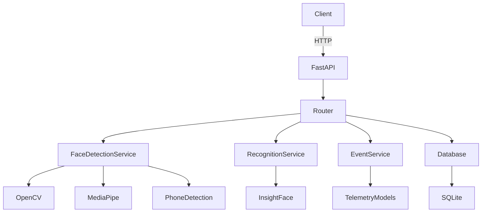
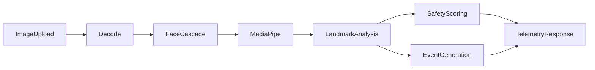

# System Architecture

## Backend Architecture
The backend is structured as a modular FastAPI application.

## Detection Pipeline

## Telemetry Pipeline
- Input frame arrives via `POST /detect-face`
- The service computes driver, vision, and vehicle telemetry
- `TelemetryResponse` is returned to the client
- The frontend consumes the response for live dashboard updates

## Emergency Pipeline
- Drowsiness and warning thresholds are monitored
- Events such as `Drowsiness Detected` and `Emergency Intervention` are created
- `emergencyMode` is set when warning count reaches the emergency threshold
- Recommended action becomes `Pull Over`
- Events can be consumed by downstream alert or parking assist systems
